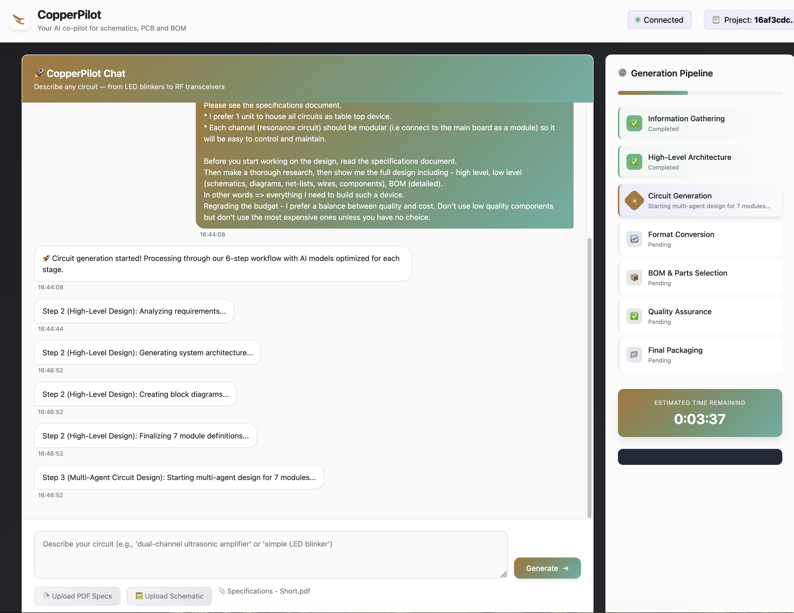
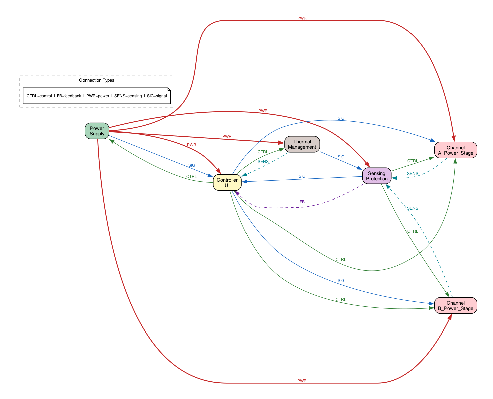
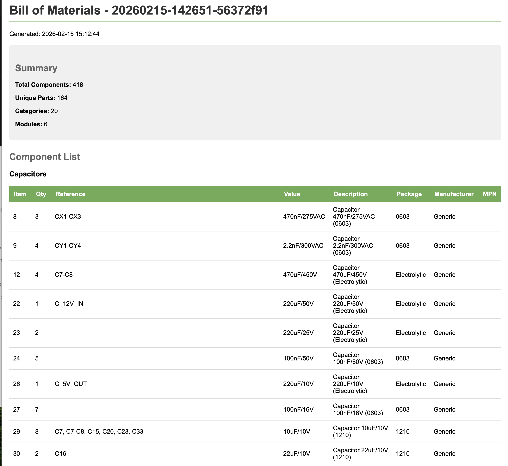

# CopperPilot

**AI-powered PCB design from natural language.**

Describe a circuit in plain English. Get production-ready schematics, PCB layouts, and bill of materials.

---

## What It Does

CopperPilot takes a natural language description like:

> "I'm building a CNC machine and need a controller for 2 stepper motors. Modern TMC drivers, hobbyist budget, quality components. Complete design — schematics, PCB, parts list, everything."

And generates:
- Complete electronic schematics (PNG + wiring descriptions)
- PCB layouts (KiCad 9, Eagle, EasyEDA Pro formats)
- Bill of Materials with real parts from Mouser/Digikey
- SPICE simulation files (.cir + LTSpice .asc)
- Quality validation reports (ERC, DRC, DFM)

---

## Screenshots







---

## Architecture

CopperPilot uses a **multi-agent AI architecture** powered by Claude:

```
DesignSupervisor (orchestrator)
├── ModuleAgent (per-module coordinator)
│   ├── ComponentAgent (component selection)
│   ├── ConnectionAgent (connection synthesis)
│   └── ValidationAgent (per-module ERC)
└── IntegrationAgent (cross-module integration)
```

Each agent handles a focused task, allowing the system to design circuits with 200+ components without context overload.

### 7-Step Workflow

1. **Information Gathering** — AI extracts requirements from your description
2. **High-Level Design** — System architecture and module breakdown
3. **Circuit Generation** — Detailed circuit design with multi-agent coordination
4. **BOM Generation** — Real parts from Mouser/Digikey with dual-supplier comparison
5. **Format Conversion** — Export to KiCad, Eagle, EasyEDA Pro, SPICE
6. **Quality Assurance** — ERC, DRC, DFM validation with self-healing fix loops
7. **Packaging** — Downloadable ZIP with all files

---

## Current Status

**This is a research project, not production software.**

- Simple circuits (1-3 modules): High success rate
- Complex circuits (7+ modules): Variable — depends on circuit complexity and AI non-determinism
- The baseline for AI doing this autonomously? Zero. This is new territory.

All generated circuits require professional engineering review before fabrication.

---

## Prerequisites

- **Python 3.11+** — [Download](https://www.python.org/downloads/) or install via package manager
- **Anthropic API key** (required) — [Get one here](https://console.anthropic.com/settings/keys)
- **KiCad 9** (optional) — For full ERC/DRC validation. [Download](https://www.kicad.org/download/)
- **Mouser / Digikey API keys** (optional) — For BOM generation with real parts

---

## Installation

### Quick Start (recommended)

```bash
# 1. Clone the repository
git clone https://github.com/zivelo1/CopperPilot.git
cd CopperPilot

# 2. Run the setup script — creates venv, installs dependencies, creates .env
chmod +x setup.sh start_server.sh
./setup.sh

# 3. Add your Anthropic API key
nano .env
# Find the line: ANTHROPIC_API_KEY=your-anthropic-api-key-here
# Replace with your actual key: ANTHROPIC_API_KEY=sk-ant-api03-...
# Save and exit (Ctrl+O, Enter, Ctrl+X)

# 4. Start the server
./start_server.sh
```

Open **http://localhost:8000** in your browser. That's it.

### Manual Installation (step by step)

If you prefer to set things up manually:

```bash
# 1. Clone
git clone https://github.com/zivelo1/CopperPilot.git
cd CopperPilot

# 2. Create and activate a Python virtual environment
python3 -m venv venv
source venv/bin/activate      # macOS / Linux
# venv\Scripts\activate       # Windows

# 3. Install dependencies
pip install --upgrade pip
pip install -r requirements.txt

# 4. Create your environment file from the template
cp .env.example .env

# 5. Edit .env and configure your API key
#    REQUIRED: Set ANTHROPIC_API_KEY to your Anthropic API key
#    OPTIONAL: Set MOUSER_API_KEY, DIGIKEY_CLIENT_ID, DIGIKEY_CLIENT_SECRET for BOM
nano .env

# 6. Start the server
python -m uvicorn server.main:app --host 0.0.0.0 --port 8000
```

### Using the Web Interface

Once the server is running:

1. Open **http://localhost:8000** in your browser
2. Describe your circuit in the text box (or upload a specifications PDF)
3. Click "Generate" and wait for the pipeline to complete
4. Download the output ZIP with schematics, PCB, BOM, and SPICE files

### Using the API

The REST API is documented at **http://localhost:8000/docs** (Swagger UI).

```bash
# Example: Create a new project
curl -X POST http://localhost:8000/api/projects \
  -H "Content-Type: application/json" \
  -d '{"description": "12V to 5V buck converter, 3A output, USB-C connector"}'
```

### Server Options

```bash
./start_server.sh              # Production mode (default)
./start_server.sh --dev        # Development mode (auto-reload on code changes)
./start_server.sh --port 9000  # Custom port
./stop_server.sh               # Stop the server
```

---

## Output Formats

| Format | Files | Description |
|--------|-------|-------------|
| KiCad 9 | .kicad_sch, .kicad_pcb, .kicad_pro | Open source EDA (production ready) |
| Eagle | .sch, .brd | Autodesk EDA (experimental) |
| EasyEDA Pro | .epro | Web-based EDA (experimental) |
| SPICE | .cir, .asc | Simulation (ngspice + LTSpice) |
| BOM | .csv, .html, .json | Dual-supplier parts list |
| Schematics | .png, .txt | Visual diagrams + wiring descriptions |

---

## Project Structure

```
CopperPilot/
├── server/              # FastAPI server + configuration
├── workflow/             # 7-step workflow orchestration
│   └── agents/          # Multi-agent system
├── ai_agents/           # AI agent manager + prompt templates
├── scripts/             # Format converters (KiCad, Eagle, EasyEDA, SPICE, BOM)
├── frontend/            # Web interface
├── tests/               # Test suite
├── docs/                # Documentation
└── data/                # Component ratings database
```

---

## Configuration

All configuration is via the `.env` file. Copy `.env.example` to `.env` and edit it.

| Variable | Required | Where to Get It |
|----------|----------|-----------------|
| `ANTHROPIC_API_KEY` | **Yes** | [console.anthropic.com/settings/keys](https://console.anthropic.com/settings/keys) |
| `MOUSER_API_KEY` | No | [mouser.com/api-search](https://www.mouser.com/api-search/) |
| `DIGIKEY_CLIENT_ID` | No | [developer.digikey.com](https://developer.digikey.com/) |
| `DIGIKEY_CLIENT_SECRET` | No | Same as above |

**AI Model overrides** — You can change which Claude model is used for each pipeline step by uncommenting lines in `.env`. See [AI Model Configuration](docs/AI_MODEL_CONFIGURATION.md) for details.

**KiCad path** — Auto-detected on macOS and Linux. Set `KICAD_CLI_PATH` manually only if auto-detection fails.

See [`.env.example`](.env.example) for the complete list of all options.

---

## Limitations

- Complex circuits may require multiple runs and manual review
- PCB routing is not always optimal (Manhattan router)
- Component availability not guaranteed
- EasyEDA Pro routing struggles with 40+ components
- This is research software — **validate before manufacturing**

---

## Documentation

| Document | Description |
|----------|-------------|
| [Project Overview](docs/PROJECT_OVERVIEW.md) | Technical architecture deep dive |
| [Testing Guide](docs/TESTING_GUIDE.md) | Test suite and validation |
| [KiCad Converter](docs/KICAD_CONVERTER.md) | KiCad 9 converter (production) |
| [SPICE Converter](docs/SPICE_CONVERTER.md) | SPICE/LTSpice converter |
| [Eagle Converter](docs/EAGLE_CONVERTER.md) | Eagle CAD converter (experimental) |
| [EasyEDA Converter](docs/EASYEDA_PRO_CONVERTER.md) | EasyEDA Pro converter (experimental) |
| [BOM System](docs/DUAL_SUPPLIER_BOM_SYSTEM.md) | Dual-supplier BOM generation |
| [AI Models](docs/AI_MODEL_CONFIGURATION.md) | Model assignments and configuration |
| [Changelog](docs/CHANGELOG.md) | Version history |

---

## Why Open Source?

I built CopperPilot to explore what AI can do in hardware design. The results surprised me — it can design real circuits with real components, and the multi-agent architecture handles complexity that would overwhelm a single prompt.

I'm not pursuing this commercially, but I believe it has value for the community. If you're interested in AI + electronics, take a look. Maybe you'll take it further.

---

## Author

**Ziv Elovitch** — Fractional CPO for DeepTech startups

---

## License

MIT License — See [LICENSE](LICENSE) for details.
