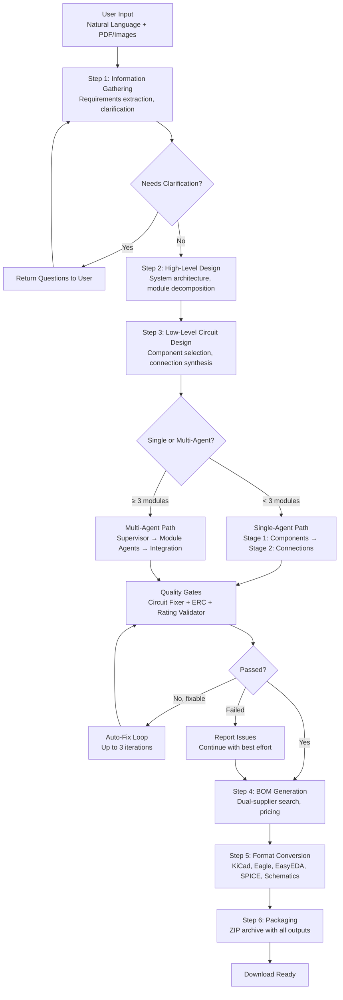
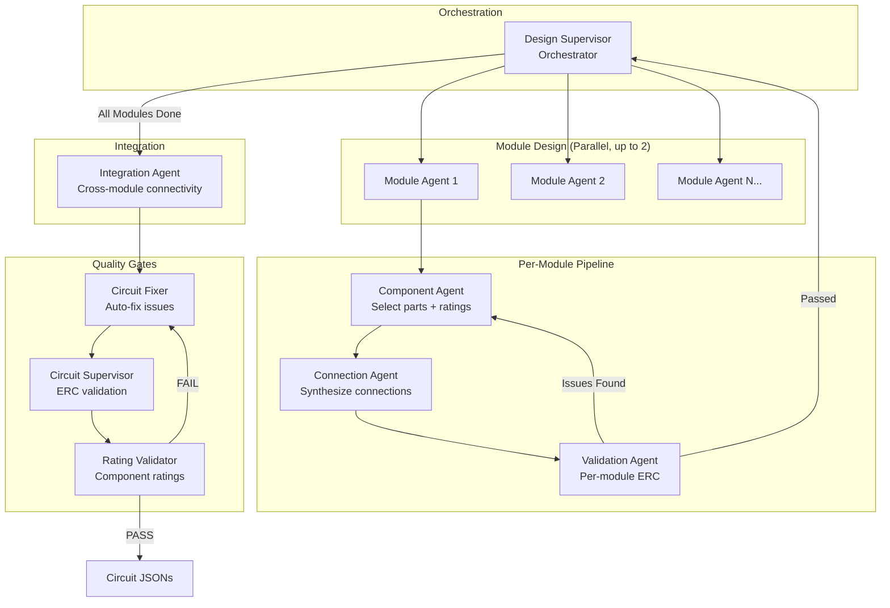
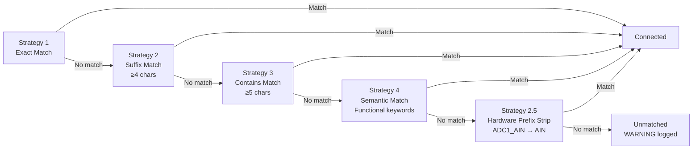
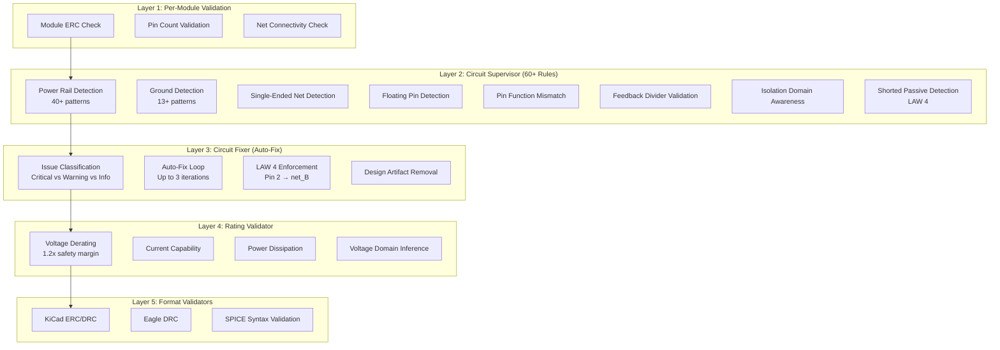
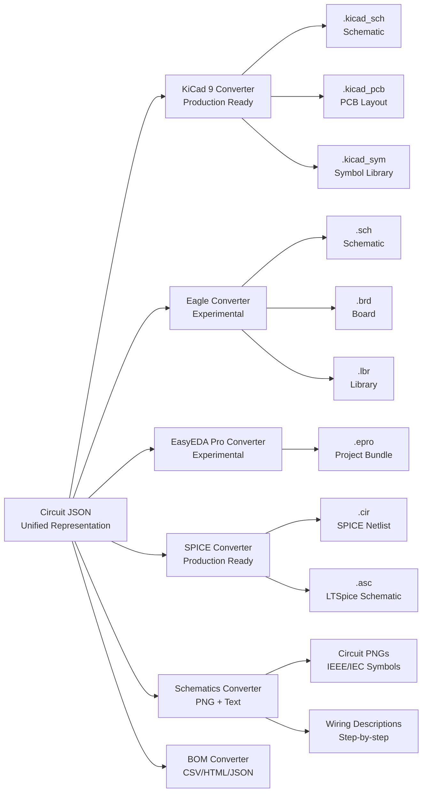
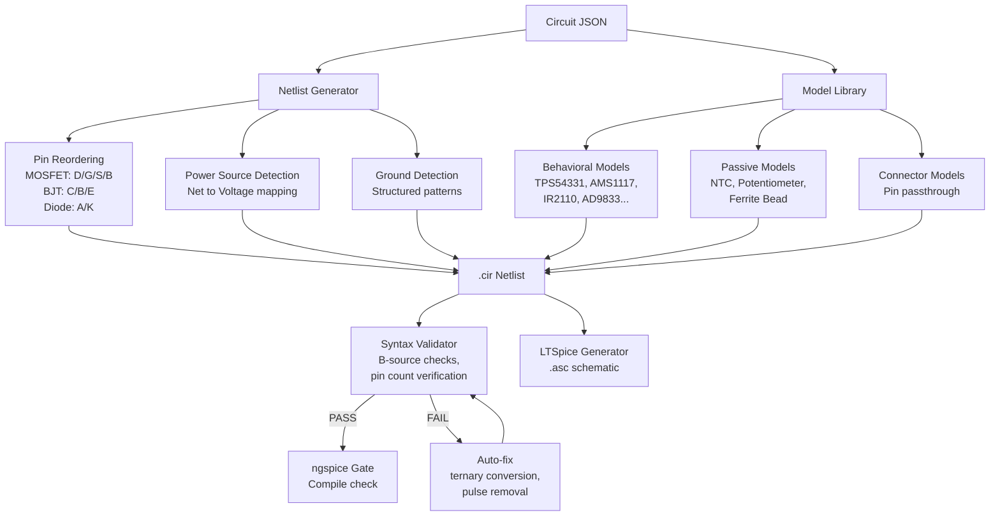
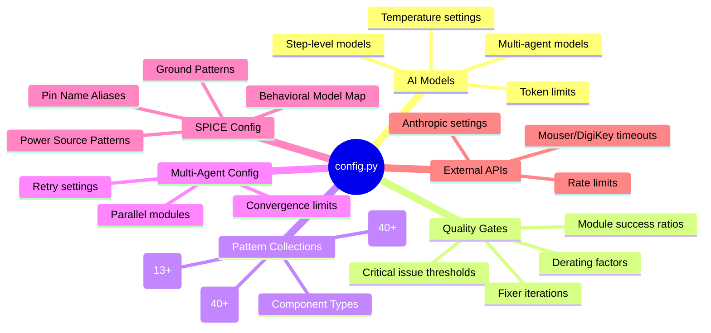
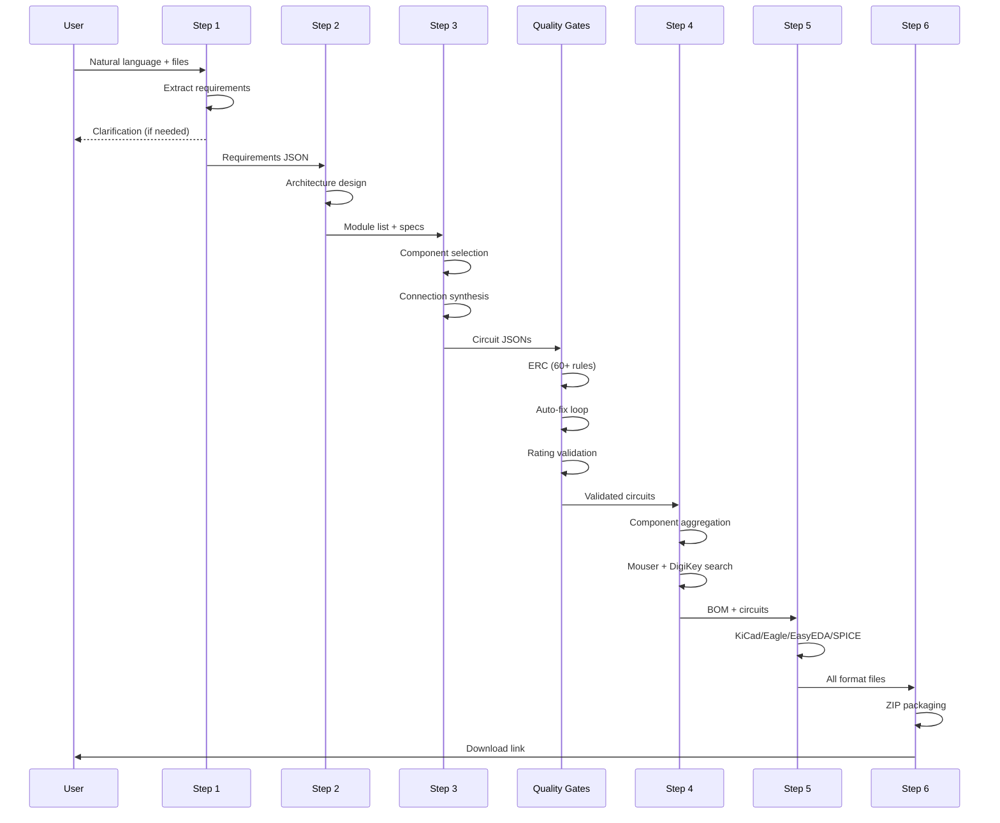

# CopperPilot — System Architecture

> AI-powered circuit design automation: from natural language to manufacturing-ready files.

**Version**: 1.0 | **Author**: Ziv Elovitch | **License**: MIT

---

## Table of Contents

1. [System Overview](#1-system-overview)
2. [High-Level Architecture](#2-high-level-architecture)
3. [Pipeline Flow](#3-pipeline-flow)
4. [Multi-Agent Architecture](#4-multi-agent-architecture)
5. [Quality Assurance System](#5-quality-assurance-system)
6. [Format Converters](#6-format-converters)
7. [SPICE Simulation Engine](#7-spice-simulation-engine)
8. [Configuration System](#8-configuration-system)
9. [API & Server Layer](#9-api--server-layer)
10. [Data Flow & Structures](#10-data-flow--structures)
11. [Directory Structure](#11-directory-structure)
12. [Design Patterns](#12-design-patterns)
13. [External Dependencies](#13-external-dependencies)
14. [Extensibility](#14-extensibility)

---

## 1. System Overview

CopperPilot transforms natural-language circuit requirements into complete, manufacturing-ready design packages. It generates:

- **Schematics** — KiCad 9, Eagle, EasyEDA Pro formats
- **PCB Layouts** — With footprints, routing, and design rule compliance
- **SPICE Netlists** — Behavioral simulation with ngspice/LTSpice
- **Bill of Materials** — Dual-supplier pricing (Mouser + DigiKey)
- **Documentation** — Schematic PNGs, wiring descriptions, assembly guides

The system uses a **hierarchical multi-agent architecture** powered by Claude (Anthropic) to manage the complexity of electronic circuit design through specialization and iterative validation.

---

## 2. High-Level Architecture

```
┌─────────────────────────────────────────────────────────────┐
│                     USER INTERFACE                           │
│            Web UI (HTML/JS) + REST API + WebSocket           │
└────────────────────────┬────────────────────────────────────┘
                         │
┌────────────────────────▼────────────────────────────────────┐
│                   FastAPI SERVER                             │
│         main.py / main_production.py + config.py            │
└────────────────────────┬────────────────────────────────────┘
                         │
┌────────────────────────▼────────────────────────────────────┐
│               7-STEP WORKFLOW PIPELINE                       │
│                                                              │
│  ┌─────┐  ┌─────┐  ┌─────┐  ┌─────┐  ┌─────┐  ┌─────┐    │
│  │ S1  │→ │ S2  │→ │ S3  │→ │ S4  │→ │ S5  │→ │ S6  │    │
│  │Info │  │High │  │Low  │  │BOM  │  │Conv │  │Pack │    │
│  │Gath.│  │Level│  │Level│  │Gen. │  │ert. │  │age  │    │
│  └─────┘  └─────┘  └──┬──┘  └─────┘  └──┬──┘  └─────┘    │
│                        │                  │                  │
│              ┌─────────▼──────┐    ┌─────▼──────────┐       │
│              │  MULTI-AGENT   │    │   FORMAT        │       │
│              │  SYSTEM        │    │   CONVERTERS    │       │
│              │  ┌───────────┐ │    │  ┌──────────┐  │       │
│              │  │Supervisor │ │    │  │ KiCad 9  │  │       │
│              │  │Module Agts│ │    │  │ Eagle    │  │       │
│              │  │Integ. Agt │ │    │  │ EasyEDA  │  │       │
│              │  └───────────┘ │    │  │ SPICE    │  │       │
│              └────────────────┘    │  │ Schem.   │  │       │
│                                    │  │ BOM      │  │       │
│                                    │  └──────────┘  │       │
│                                    └────────────────┘       │
└─────────────────────────────────────────────────────────────┘
                         │
┌────────────────────────▼────────────────────────────────────┐
│                 QUALITY ASSURANCE                            │
│   Circuit Supervisor (ERC) ─ Circuit Fixer ─ Rating Valid.  │
└─────────────────────────────────────────────────────────────┘
                         │
┌────────────────────────▼────────────────────────────────────┐
│                 EXTERNAL SERVICES                            │
│   Claude API (Anthropic) ─ Mouser API ─ DigiKey API         │
│   KiCad CLI ─ Graphviz ─ ngspice                            │
└─────────────────────────────────────────────────────────────┘
```

---

## 3. Pipeline Flow

The system operates as a 6-step sequential pipeline, where each step builds on the output of the previous one.



### Step Details

| Step | Module | AI Model | Typical Duration | Output |
|------|--------|----------|------------------|--------|
| 1 | `step_1_gather_info.py` | Sonnet 4.5 | 30-60s | Requirements JSON |
| 2 | `step_2_high_level.py` | Opus 4.6 | 60-120s | Module list + block diagram |
| 3 | `step_3_low_level.py` | Opus 4.6 | 5-20 min | Circuit JSONs per module |
| 4 | `step_4_bom.py` | Sonnet 4.5 | 2-5 min | BOM (CSV/JSON/HTML) |
| 5 | Format converters | — | 1-3 min | KiCad/Eagle/EasyEDA/SPICE files |
| 6 | `step_6_packaging.py` | — | 30-60s | ZIP archive |

---

## 4. Multi-Agent Architecture

For complex circuits (3+ modules), CopperPilot uses a hierarchical multi-agent system to manage AI context limits and ensure quality.



### Agent Responsibilities

| Agent | Model | Token Limit | Responsibility |
|-------|-------|-------------|----------------|
| **Design Supervisor** | Opus 4.6 | 20,000 | Orchestrates module design, convergence management |
| **Component Agent** | Opus 4.6 | 20,000 | Component selection with rating guidelines |
| **Connection Agent** | Sonnet 4.5 | 20,000 | Connection synthesis, net topology |
| **Validation Agent** | Haiku 4.5 | 8,000 | Per-module ERC, issue detection |
| **Integration Agent** | Sonnet 4.5 | 20,000 | Cross-module signal routing, backplane creation |

### Integration Agent Signal Matching

The Integration Agent uses a 4-strategy cascade for matching interface signals across modules:



---

## 5. Quality Assurance System

CopperPilot uses a multi-layer validation architecture with 60+ specialized detection rules.



### Quality Gate Configuration

| Gate | Default | Purpose |
|------|---------|---------|
| `max_critical_fixer_issues` | 0 | Max critical issues allowed (fail-closed) |
| `min_successful_module_ratio` | 0.5 | Min fraction of successfully designed modules |
| `min_interface_connection_ratio` | 0.5 | Min interface signals connected |
| `voltage_derating_factor` | 1.2 | Component voltage safety margin |
| `max_fixer_iterations` | 3 | Max auto-fix attempts per circuit |
| `max_supervisor_iterations` | 10 | Max validation loop iterations |

---

## 6. Format Converters



### Converter Maturity

| Converter | Status | Output Format | Key Features |
|-----------|--------|---------------|--------------|
| **KiCad 9** | Production | .kicad_sch/.kicad_pcb | 6-phase routing, label connectivity, IPC-7351B pads |
| **Eagle** | Experimental | .sch/.brd/.lbr | MST routing, symbol library, DRC validation |
| **EasyEDA Pro** | Experimental | .epro | Manhattan router, self-healing loop |
| **SPICE** | Production | .cir/.asc | 20+ behavioral models, pin reordering, ngspice gate |
| **Schematics** | Production | PNG/Text | IEEE symbols, A* wire routing, domain clustering |
| **BOM** | Production | CSV/HTML/JSON | Dual-supplier (Mouser + DigiKey), pricing |

---

## 7. SPICE Simulation Engine



---

## 8. Configuration System

All configuration is centralized in `server/config.py` with environment variable overrides.

### Configuration Categories



### Key Pattern Collections (100+)

| Collection | Count | Purpose |
|------------|-------|---------|
| `POWER_RAIL_PATTERNS` | 40+ | Detect power nets (VCC, VDD, +12V, VBUS...) |
| `SPICE_GROUND_PATTERNS` | 13+ | Detect ground nets (GND, VSS, VEE...) |
| `INTERFACE_NET_PATTERNS` | 40+ | Detect interface signals (SDA, SCL, MOSI...) |
| `NON_ACTIVE_COMPONENT_TYPES` | 36 | Passives, connectors, electromechanical |
| `BEHAVIORAL_MODEL_PIN_MAP` | 13 ICs | Pin mapping for specific ICs |
| `SPICE_PIN_NAME_ALIASES` | 30+ | AI pin name → canonical SPICE name |
| `SEMANTIC_TAXONOMY` | 6 categories | Component type classification |

---

## 9. API & Server Layer

### REST API Endpoints

```
POST   /api/generate              — Start circuit generation
POST   /api/generate/upload       — Generation with file uploads (PDF, images)
POST   /api/continue              — Submit clarification responses
GET    /api/status/{project_id}   — Project status and progress
GET    /api/download/{project_id} — Download completed design package (ZIP)
GET    /api/projects              — List all projects
GET    /health                    — Server health check
WS     /ws/{project_id}          — Real-time progress streaming
```

### Debug Endpoints (Development Only)

```
POST   /api/debug/test-fix-logic          — Test circuit fixing without AI
GET    /api/debug/{project_id}/{step}     — Step-specific debug info
POST   /api/replay/{project_id}/{step}    — Replay step with saved inputs
```

---

## 10. Data Flow & Structures

### Circuit JSON Schema (Internal Representation)

```json
{
  "module_name": "Power Supply",
  "validation_status": "PERFECT",
  "components": [
    {
      "ref": "U1",
      "type": "IC",
      "value": "TPS54331",
      "package": "SOIC-8",
      "specs": {
        "operating_voltage": "4.5-17V",
        "isolation_domain": null
      },
      "pins": {
        "VIN": { "num": 1, "type": "power_in" },
        "GND": { "num": 5, "type": "ground" },
        "SW":  { "num": 8, "type": "output" }
      }
    }
  ],
  "connections": [
    { "net": "VCC_12V", "pins": ["U1.VIN", "C1.1", "J1.1"] },
    { "net": "GND",     "pins": ["U1.GND", "C1.2", "C2.2", "J1.2"] }
  ]
}
```

### Data Flow Between Steps



---

## 11. Directory Structure

```
CopperPilot/
├── server/                          # FastAPI server + configuration
│   ├── main.py                      # Production API server
│   ├── main_production.py           # Full workflow orchestration
│   └── config.py                    # Central config (100+ settings)
│
├── workflow/                        # 7-step pipeline engine
│   ├── step_1_gather_info.py        # Requirements extraction
│   ├── step_2_high_level.py         # System architecture
│   ├── step_3_low_level.py          # Circuit design (critical)
│   ├── step_4_bom.py                # Bill of Materials
│   ├── step_5_quality_assurance.py  # QA validation
│   ├── step_6_packaging.py          # Output packaging
│   ├── circuit_fixer.py             # Auto-fix engine
│   ├── circuit_supervisor.py        # ERC engine (60+ rules)
│   ├── circuit_postprocessor.py     # Pre-validation cleanup
│   ├── component_rating_validator.py # Rating checks
│   ├── input_processor.py           # Input normalization
│   ├── state_manager.py             # Workflow state
│   └── agents/                      # Multi-agent system
│       ├── design_supervisor.py     # Orchestrator
│       ├── integration_agent.py     # Cross-module integration
│       ├── module_agent.py          # Per-module coordinator
│       ├── component_agent.py       # Component selection
│       ├── connection_agent.py      # Connection synthesis
│       └── validation_agent.py      # Per-module validation
│
├── ai_agents/                       # AI integration layer
│   ├── agent_manager.py             # Claude API client
│   └── prompts/                     # Prompt templates
│       ├── step_3_design_module.txt
│       ├── step_3_stage1_components.txt
│       └── multi_agent/             # Multi-agent prompts
│
├── scripts/                         # Format converters
│   ├── kicad_converter.py           # KiCad 9 (production)
│   ├── eagle_converter.py           # Eagle (experimental)
│   ├── easyeda_converter_pro.py     # EasyEDA Pro (experimental)
│   ├── schematics_converter.py      # PNG schematic generator
│   ├── schematics_text_converter.py # Wiring descriptions
│   ├── bom_converter.py             # BOM aggregation
│   └── spice/                       # SPICE simulation
│       ├── model_library.py         # Behavioral models
│       ├── netlist_generator.py     # .cir netlist creation
│       ├── ltspice_generator.py     # .asc file generation
│       ├── simulation_validator.py  # Syntax validation
│       └── spice_utils.py           # Unicode sanitization
│
├── frontend/                        # Web interface
│   └── index.html                   # SPA with WebSocket support
│
├── utils/                           # Shared utilities
│   ├── logger.py                    # Logging configuration
│   ├── enhanced_logger.py           # Per-run step logging
│   └── project_manager.py           # Project lifecycle
│
├── data/                            # Static data
│   └── component_ratings.json       # IC rating database (177 entries)
│
├── tests/                           # Test suite (26+ scripts)
│   ├── analyze_lowlevel_circuits.py # Critical circuit validator
│   ├── test_kicad_converter.py      # KiCad pytest
│   ├── test_eagle_converter.py      # Eagle pytest
│   └── ...
│
├── docs/                            # Documentation
│   ├── ARCHITECTURE.md              # This document
│   ├── PROJECT_OVERVIEW.md          # Technical overview
│   ├── KICAD_CONVERTER.md           # KiCad converter docs
│   ├── SPICE_CONVERTER.md           # SPICE converter docs
│   ├── TESTING_GUIDE.md             # Testing guide
│   └── ...
│
├── .env.example                     # Environment template
├── requirements.txt                 # Python dependencies
├── setup.sh                         # Setup script
├── start_server.sh                  # Server launcher
└── stop_server.sh                   # Server stopper
```

---

## 12. Design Patterns

### Singleton — AI Agent Manager
```python
# Single global instance ensures consistent cost tracking and connection pooling
agent_manager = AIAgentManager()  # Shared across all workflow steps
```

### Strategy — Signal Matching
The Integration Agent uses a strategy cascade for matching interface signals across module boundaries. Each strategy progressively relaxes matching criteria.

### Pipeline — Workflow Steps
Each step transforms the output of the previous step, with quality gates between critical stages.

### Observer — Real-Time Progress
WebSocket connections stream step-by-step progress to connected clients, enabling real-time UI updates.

### Factory — Behavioral Models
The Model Library generates appropriate SPICE models based on component type, with specialized factories for ICs, passives, connectors, and electromechanical devices.

### Fail-Closed Safety
All quality gate flags default to `False` (fail-closed). A circuit must explicitly pass validation — never assumed to pass.

---

## 13. External Dependencies

### Required
| Service | Purpose | Configuration |
|---------|---------|---------------|
| **Anthropic Claude API** | AI-powered circuit design | `ANTHROPIC_API_KEY` |

### Optional
| Service | Purpose | Configuration |
|---------|---------|---------------|
| **Mouser API** | Component pricing/availability | `MOUSER_API_KEY` |
| **DigiKey API** | Dual-supplier comparison | `DIGIKEY_CLIENT_ID` + `DIGIKEY_CLIENT_SECRET` |
| **KiCad CLI** | Schematic/layout validation | Auto-detected |
| **Graphviz** | Block diagram rendering | Auto-detected |
| **ngspice** | SPICE simulation validation | Auto-detected |

### Python Dependencies
Core: `anthropic`, `fastapi`, `uvicorn`, `pydantic`, `python-dotenv`, `httpx`, `websockets`

---

## 14. Extensibility

### Adding a New Component Type
1. Add to `SEMANTIC_TAXONOMY` in `config.py`
2. Create SPICE model in `model_library.py`
3. Add pin mapping to `BEHAVIORAL_MODEL_PIN_MAP`
4. Update rating validator logic

### Adding a New Format Converter
1. Create `scripts/{format}_converter.py`
2. Implement `convert(circuit_json, output_dir)` interface
3. Register in Step 5 conversion pipeline
4. Add validation rules

### Adding a New Validation Rule
1. Add detection in `circuit_supervisor.py`
2. Implement auto-fix in `circuit_fixer.py`
3. Configure patterns in `config.py`
4. Add test case

### Adding a New AI Agent
1. Create agent class in `workflow/agents/`
2. Define prompts in `ai_agents/prompts/`
3. Register with `DesignSupervisor`
4. Configure model in `config.MODELS`

---

## Performance Characteristics

| Metric | Value |
|--------|-------|
| **Simple circuit (1-3 modules)** | 8-12 minutes total |
| **Complex circuit (4-8 modules)** | 15-30 minutes total |
| **Max parallel modules** | 2 (API rate limit) |
| **API cost per circuit** | $0.50 - $5.00 |
| **Disk per project** | 50-500 MB |
| **Quality gate pass rate** | ~90% (simple), ~66% (complex) |

---

*Copyright (c) 2024-2026 Ziv Elovitch. Licensed under MIT.*
